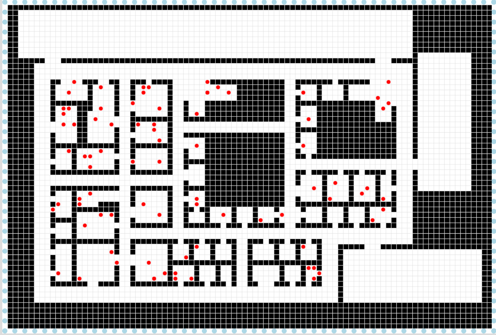
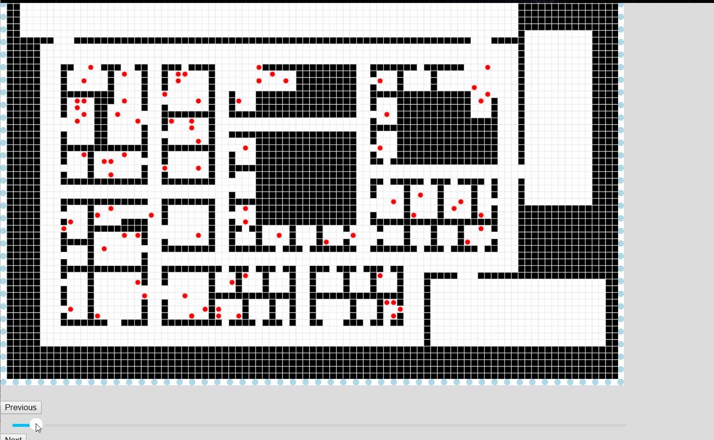

## 撤离数据可视化

本项目完全是针对2008年 IEEE VAST 会议中Evacuation Trace迷你挑战赛获奖作品的前端实现。

### 实现技术
+ HTML CSS JavaScript
+ HTML5 Canvas

### Evacuation Trace 内容概要

2008年的VAST挑战赛分为4个子项， Evacuation Trace 是其中的一个子题目。 题目背景是2007年美国佛罗里达州，迈阿密市一栋政府大楼遭到了小型爆炸装置袭击，造成了一定程度的伤亡，该大楼中正在试点RFID技术，所有工作人员和造访者都佩戴了基于此技术的定位徽章，因此能拿到所有在场人员的移动轨迹数据。

题目提供的数据分为三个txt文件，分别记录着 大楼爆炸层平面图地图数据a， RFID id号和人名的对应关系数据b， 以及每一个RFID在爆炸前后的位置数据c。

数据a均为0 1 字符， 1代表墙面或障碍物， 0代表人可行走的空间， 组成了一个长 91 ＊ 宽 61 的方格地图，实现如下：

数据b 为两列字符串，第一列字符串代表RFID 标签编号， 第二列代表对应的佩戴者；

数据c 为4列字符串，第一列代表时间帧id， 第二列RFID标签号， 三四列分别为基于平面地图的 x y坐标。 上图中我以红点表示RFID 标签位置。

题目要求参赛者设计一种可视化方式，利用这些数据解决以下四个问题：

+ 爆炸装置在何处引爆
+ 找出可能的嫌疑人和证人
+ 找出所有离开建筑的嫌疑人和证人
+ 统计伤亡情况

我参考的获奖作品在论文中提出了一种 针对题目这种时变空域数据的 “染色” 可视化方式，详细介绍请参考论文：

+ [英文原文](./documents/Innovativ_Trace_Visualization_Staining_for_Information_Discovery.pdf)
+ [我的总结翻译](./documents/translate_ch.pdf)

### 功能

已实现功能：
+ 地图展示
+ 人物位置展示
+ 按钮控制帧数据展示（前进，后退，播放）
+ 滑动条控制帧数据展示 （拖动播放，点击跳转）

先放一个小demo：

待实现功能：
+ 鼠标悬停在点上后显示人物名称（canvas中图形的事件绑定）
+ 地图上的区块染色
+ 滑动进度条上的区段染色
+ 染色的相关统计展示（人物名单、反选）